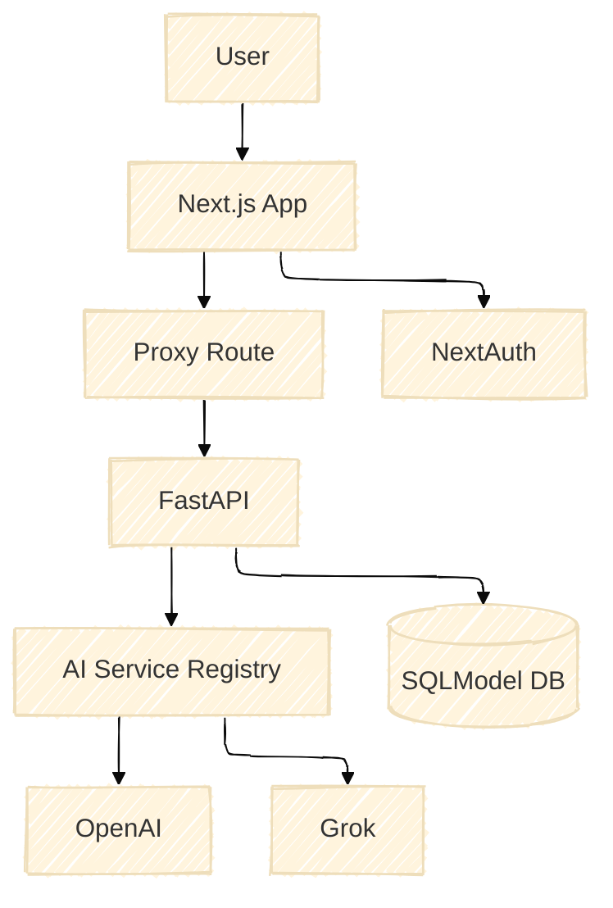

[](https://opensource.org/licenses/Apache-2.0)

# PluginMind – Secure AI SaaS Starter 🚀

PluginMind is a **FastAPI + Next.js** starter built for teams who want production-ready blocks for AI-powered applications. The current release focuses on a hardened backend with a plugin-style AI service registry, session-cookie authentication, and 100+ automated tests so you can ship with confidence.

> **Good news!** All documentation in this repository has been refreshed. You can find the full developer guide inside [`docs/`](./).

---

## ✨ What You Get Today

| Capability | Status | Details |
|------------|--------|---------|
| 🧠 **Generic AI Processing** | ✅ | Unified `/process` endpoint orchestrating OpenAI (prompt optimization) and Grok (analysis) via the service registry. |
| 🔐 **Session Security** | ✅ | Google sign-in through NextAuth proxy with backend-issued HttpOnly `pm_session` cookies. |
| ⚙️ **Plugin AI Registry** | ✅ | Registry pattern with service metadata, health checks, and async job tracking. |
| 📊 **Structured Observability** | ✅ | Correlation IDs, unified error envelopes, rate limiting headers, and `/health` + `/services/health` endpoints. |
| 🧪 **Automated Testing** | ✅ | **154 total tests**: 117 backend (pytest) + 37 frontend (Jest) covering routing, registry, auth, UI components, and error flows. |
| 📦 **Container & Migrations** | ✅ | Multi-stage backend Dockerfile, docker-compose orchestration, and Alembic migrations. |

---

## 🏁 Quick Start

```bash
# Backend (FastAPI)
cd pluginmind_backend
pip install -r requirements.txt
uvicorn app.main:app --reload --host 0.0.0.0 --port 8000

# Frontend (Next.js)
cd frontend
pnpm install
pnpm dev
```

**Environment essentials**
```bash
# Backend
OPENAI_API_KEY=sk-...
GROK_API_KEY=xai-...
GOOGLE_CLIENT_ID=your-client-id.apps.googleusercontent.com
GOOGLE_CLIENT_SECRET=your-client-secret
BACKEND_SESSION_SECRET=at-least-32-chars

# Frontend
NEXTAUTH_URL=http://localhost:3000
NEXTAUTH_SECRET=your-nextauth-secret
BACKEND_URL=http://localhost:8000
```

> **Backend**: Run `TESTING=1 pytest` inside `pluginmind_backend/` to verify the stack (117 tests).
> **Frontend**: Run `pnpm test` inside `frontend/` for UI component tests (37 tests).
> Both test suites boot with safe defaults and mock external calls.

---

## 🧩 Architecture Highlights

- **Frontend (Next.js 14)** → NextAuth handles Google OAuth, a Node runtime proxy injects Google ID tokens, and requests flow through `/api/proxy/...` with cookies attached.
- **Backend (FastAPI)** → Middleware stack adds correlation IDs, security headers, ambient token logging, and strict body-size enforcement.
- **AI Registry** → `analysis_service` pulls prompt optimizers and analyzers from `ai_service_registry`, prioritising OpenAI for prompting and Grok for analysis.
- **Persistence** → SQLModel models (`User`, `AnalysisJob`, `QueryLog`, `AnalysisResult`) persist to SQLite/PostgreSQL through a shared engine.
- **Async Jobs** → `/analyze-async` enqueues UUID-tagged jobs stored in `analysis_jobs` with status transitions handled in `background_tasks.py`.
- **Database Migrations** → Alembic manages schema upgrades (`alembic/`, `alembic.ini`).



Detailed diagrams live in [`docs/architecture`](./architecture/).

---

## 📚 Documentation Map

```text
docs/
├── guides/
│   ├── ai-service-integration.md
│   ├── workflow-development.md
│   ├── deployment-advanced.md
│   ├── security-hardening.md
│   └── frontend-development.md
├── api/
│   ├── endpoints.md
│   └── authentication.md
├── architecture/
│   ├── system-design.md
│   └── database-schema.md
└── operations/
    ├── testing.md
    ├── monitoring.md
    └── troubleshooting.md
```

Each page reflects the **current** implementation, highlights extension points, and links back to source files for quick navigation.

---

## 🗺️ Roadmap (Next Up)

1. **Multi-provider workflows** – Add first-class support for Anthropic Claude and Google Gemini, including routing by capabilities and chained execution.
2. **Metrics & Telemetry** – Expose Prometheus-ready metrics (`http_requests_total`, `ai_request_duration_seconds`) and bundle Grafana dashboards.
3. **Workflow Builder UI** – Expand the frontend with a drag-and-drop workflow designer backed by registry metadata.
4. **Usage Billing Hooks** – Track token counts and costs per query for downstream invoicing and quota enforcement.
5. **Deployment Recipes** – Terraform modules and GitHub Actions templates for AWS/GCP production rollouts.

> Interested in contributing? Open an issue with the roadmap item you’d like to tackle, or start a discussion in the repo.

---

## 💬 Support & Community

- Issues & Enhancements → [GitHub Issues](https://github.com/GhostRobo-MAG/pluginmind-/issues)

- Discord → [@pluginmind](https://discord.gg/pu6UV3y7xv)

Happy building! 🧑‍💻
