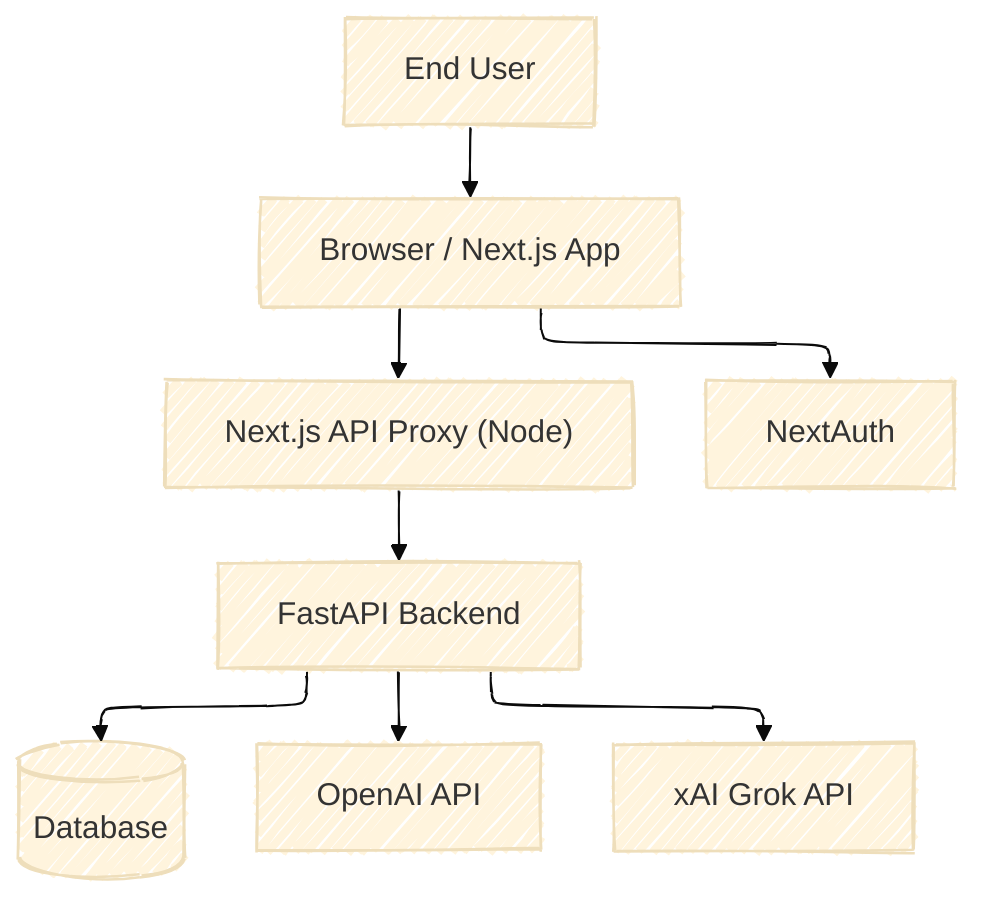
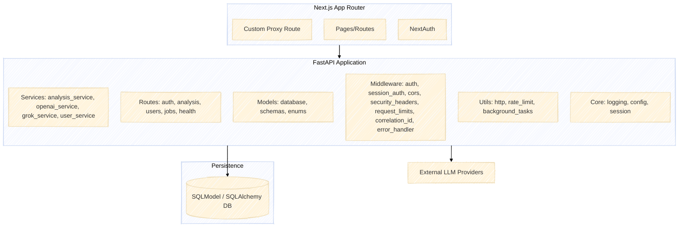
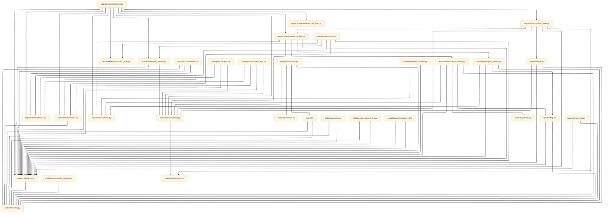

# SYSTEM GROUND TRUTH

Last generated: 2025-09-12T06:07:52Z

## 1) Overview

PluginMind is a full-stack system composed of a Next.js App Router frontend (with NextAuth) and a FastAPI backend. Users sign in with Google via NextAuth; the frontend performs a one-time bind to the backend by posting a Google ID token through a Node runtime proxy. The backend verifies the Google token and issues an HttpOnly session cookie (`pm_session`). Thereafter, the frontend makes authenticated requests through the proxy, and the backend uses session-cookie authentication, enforces rate limits, logs queries, and orchestrates AI services (OpenAI for prompt optimization and Grok for analysis) with resilient HTTP utilities and structured logging.

Key flows: Sign-in and bind (one-time), steady-state requests using session cookies, AI processing (prompt optimization + analysis), background job processing for async analyses, and observability through correlation IDs and unified error handling.

## 2) System Context (C4 Level 1)

## 3) Containers (C4 Level 2)

## 4) Components (C4 Level 3)

Derived from imports and call sites in the codebase.

## 5) End-to-End User Journeys (Sequence Diagrams)

### 5.1 Sign‑in and Bind Flow

Implementations:
- NextAuth config/provider/callbacks: frontend/src/auth.ts (jwt/session callbacks)
- Proxy bind endpoint: frontend/src/app/api/proxy/[...path]/route.ts (lines around 50–101)
- Backend bind route: pluginmind_backend/app/api/routes/auth.py::google_auth
- Token verification: pluginmind_backend/app/middleware/auth.py::verify_google_id_token_claims
- Session issuance: pluginmind_backend/app/core/session.py::create_session_token, get_cookie_settings

### 5.2 Authenticated AI Request (Steady‑state)

Implementations:
- Route: pluginmind_backend/app/api/routes/analysis.py::process_generic
- Session auth: pluginmind_backend/app/middleware/session_auth.py::get_session_user
- User mgmt: pluginmind_backend/app/services/user_service.py
- Orchestration: pluginmind_backend/app/services/analysis_service.py
- Outbound HTTP: pluginmind_backend/app/utils/http.py
- Models: pluginmind_backend/app/models/database.py

### 5.3 Background Task Lifecycle (Async)

Implementations:
- Start job: pluginmind_backend/app/api/routes/analysis.py::start_async_analysis
- Background worker: pluginmind_backend/app/utils/background_tasks.py::process_analysis_background
- Job fetch: pluginmind_backend/app/api/routes/analysis.py::get_analysis_result
- Model: pluginmind_backend/app/models/database.py::AnalysisJob

## 6) Data Model & Persistence Map

- pluginmind_backend/app/models/database.py
  - AnalysisJob: async job tracking (job_id, status, timestamps, results, user_id)
  - User: basic account (email, subscription_tier, queries_used/limit, google_id)
  - QueryLog: per-request logging (user_input, optimized_prompt, ai_result, timings, costs)
  - AnalysisResult: generic analysis storage (analysis_id, analysis_type, user_input, result_data JSON, metadata JSON, status)

Relationships: See ERD in legacy SYSTEM_MAP and components diagram above. User foreign-key style refs are by value (google_id/email), not enforced FKs at DB level in code shown.

## 7) Entity Relationship Diagram (Mermaid)

### Migrations (Alembic)

- Config and scripts:
  - pluginmind_backend/alembic.ini
  - pluginmind_backend/alembic/env.py
  - pluginmind_backend/alembic/versions/001_initial_pluginmind_schema.py (example version)
  - pluginmind_backend/scripts/manage_db.py (wraps revision/upgrade/downgrade/current/history)
- Usage (per README/docs):
  - Create revision: `alembic revision --autogenerate -m "msg"`
  - Upgrade: `alembic upgrade head`
  - Downgrade: `alembic downgrade -1`

## 7) Configuration & Feature Flags

- pluginmind_backend/app/core/config.py
  - Debug/testing toggles; HTTP client timeouts and retries; rate limit caps; AI provider models and API keys; CORS origins; Google OAuth client id; backend session secret validation.
- Frontend env (frontend/.env.local)
  - BACKEND_URL (proxy target): dev uses http://127.0.0.1:8000; prod should be https://api.example.com
  - NEXTAUTH_URL, NEXTAUTH_SECRET
  - NEXT_PUBLIC_USE_API_PROXY=true, NEXT_PUBLIC_SECURE_TOKENS=true (secure mode)
- Proxy (frontend/src/app/api/proxy/[...path]/route.ts)
  - Enforces Node runtime, reads only BACKEND_URL; injects id_token for /auth/google; forwards cookies and Set-Cookie; 502 only on thrown fetch.

[UNKNOWN]: Cookie domain for cross-subdomain deployments is not set in get_cookie_settings(); currently relies on default host scoping.

## 8) Observability & Reliability

- Correlation IDs: pluginmind_backend/app/middleware/correlation_id.py stores request_id in context; logging filter injects it into logs (app/core/logging.py).
- Error handling: pluginmind_backend/app/middleware/error_handler.py centralizes exception → code mapping and JSON shape; validation errors mapped to 422 with INVALID_INPUT.
- Rate limiting: token-bucket in-memory (app/utils/rate_limit.py) with dependency wrapper (app/api/dependencies_rate_limit.py) supporting user and IP keys.
- Outbound HTTP resilience: httpx AsyncClient with retries/backoff (app/utils/http.py); configurable limits from app/core/config.py.
- Security headers and body limits: middleware/security_headers.py, middleware/request_limits.py.

## 9) Open Questions / TODOs

- [UNKNOWN] Cookie domain strategy for prod with multiple subdomains (none set).
- [UNKNOWN] Background tasks scaling: current `asyncio.create_task` suggests single-process; no external queue/worker.
- TODO: In `frontend/src/services/api.service.ts`, prefer proxy baseURL in secure mode and remove localhost fallback for prod builds.

## Changelog

- 2025-09-12: Initial ground-truth document and diagrams generated; legacy SYSTEM_MAP marked deprecated.
- 2025-09-12: Updated to document Alembic migrations (config, env, versions, manage_db.py) and removed migrations [UNKNOWN].
