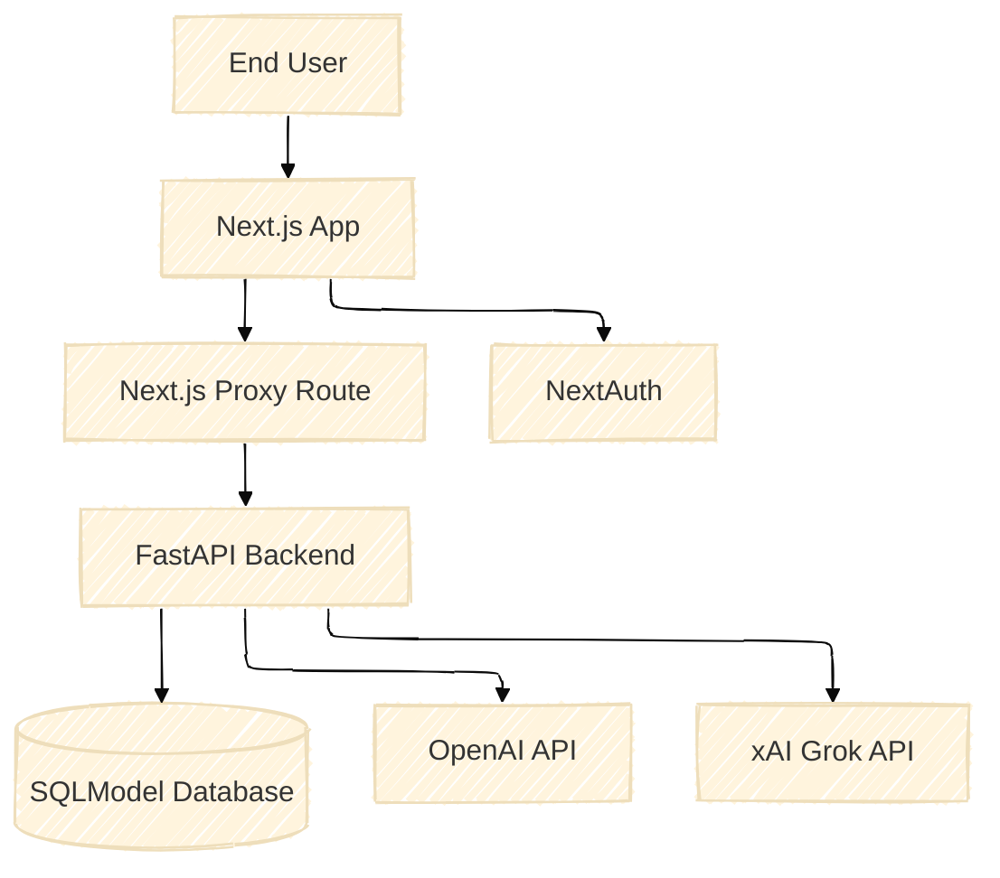
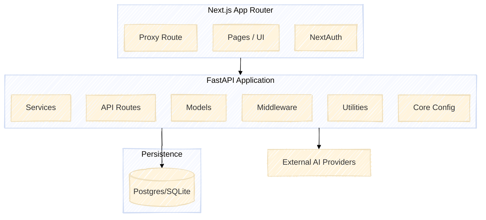

# 🏛️ System Design

This document mirrors the latest “System Ground Truth” with the details that are running in the repository today.

---

## 1. Executive Overview

PluginMind is a full-stack system:
- **Frontend** – Next.js App Router with NextAuth, a secure proxy, and Tailwind UI components.
- **Backend** – FastAPI service with an AI service registry, session-cookie auth, and SQLModel persistence.
- **AI Providers** – OpenAI handles prompt optimisation, Grok performs final analysis.

Users authenticate with Google → NextAuth (frontend) → FastAPI issues a `pm_session` cookie for subsequent requests.

---

## 2. System Context (C4 Level 1)

---

## 3. Containers (C4 Level 2)

Key highlights:
- **Middleware stack** – correlation IDs, security headers, rate limiting, ambient JWT logging.
- **Services** – `analysis_service`, `openai_service`, `grok_service`, `user_service`.
- **Utilities** – HTTP client helper, background job processor.

---

## 4. Components (C4 Level 3)

- `app/api/routes/analysis.py` – `/process`, `/analyze`, async job endpoints.
- `app/services/analysis_service.py` – orchestrates prompt optimisation, analyzer selection, and persistence.
- `app/services/service_initialization.py` – binds OpenAI & Grok to registry slots (`PROMPT_OPTIMIZER`, `DOCUMENT_PROCESSOR`, etc.).
- `app/middleware/session_auth.py` – dependency-injected session verification and helpers.
- `app/utils/background_tasks.py` – updates `analysis_jobs` lifecycle for async flows.
- `app/models/database.py` – SQLModel tables (`User`, `AnalysisJob`, `QueryLog`, `AnalysisResult`).

---

## 5. End-to-End Journeys

### 5.1 Sign-in & Bind

1. User signs in via Google → NextAuth obtains ID token.
2. Proxy route posts `id_token` to `/auth/google`.
3. Backend validates token, issues `pm_session` cookie.
4. Future requests include the cookie; bearer tokens no longer needed.

### 5.2 Generic Analysis

1. Frontend posts to `/process` with `analysis_type` (document/chat/seo/custom/crypto).
2. Backend selects the right services, stores result, returns metadata (optimiser/analyser names).
3. Client renders data (e.g., summary, key points).

---

## 6. Tech Stack Summary

| Layer | Technology |
|-------|------------|
| Frontend | Next.js 14, React 18, Tailwind CSS, shadcn/ui, SWR |
| Auth | NextAuth (Google), session cookies |
| Backend | FastAPI, SQLModel, Pydantic v2 |
| AI Providers | OpenAI (prompt optimisation), Grok xAI (analysis) |
| Infrastructure | Docker, Alembic, pytest, httpx |

---

## 7. Known Limitations

- Service registry currently prioritises the **first** registered service per type.
- Metrics (`/metrics`) and Redis-backed caching are planned but not yet implemented (see roadmap).
- Only synchronous `/process` and basic async jobs are available—no multi-hop chains yet.

These are tracked on the project roadmap inside [`docs2/README.md`](../README.md#️-roadmap-next-up).

---

For database-specific details, continue to [Database Schema](./database-schema.md). Happy designing! 🏗️
