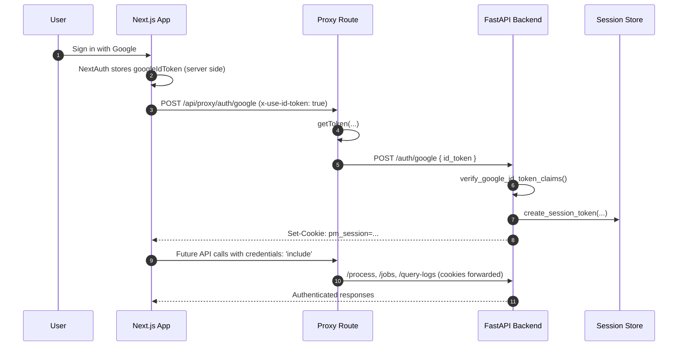

# 🔐 Authentication Guide

PluginMind uses a **dual-stage authentication flow** that keeps tokens server-side while giving the backend full control over sessions.

---

## 🧭 Overview

1. **NextAuth (frontend)** handles Google OAuth using the App Router runtime.
2. The custom proxy at `src/app/api/proxy/[...path]/route.ts` extracts the Google ID token and forwards it to the backend exactly once.
3. **FastAPI** validates the token via Google, creates a signed `pm_session` cookie, and returns it to the browser.
4. All subsequent requests rely on the `pm_session` cookie—no access tokens are exposed to client-side code.



---

## 🛠️ Backend Endpoints

| Endpoint | Method | Description |
|----------|--------|-------------|
| `/auth/google` | POST | Validates Google ID token and issues `pm_session`. Requires body `{ "id_token": "..." }`. |
| `/auth/logout` | POST | Clears the session cookie using `get_logout_cookie_settings()`. |
| `/auth/validate` | GET | Legacy helper returning `{ valid: true }` for valid bearer tokens. |
| `/auth/me` | GET | Returns the authenticated user using the session cookie (structured for the Next.js frontend). |

All endpoints pull the session via `get_session_user` or `get_session_payload` (`app/middleware/session_auth.py`).

---

## 🍪 Session Cookie Details

```python
from app.core.session import create_session_token

token = create_session_token(
    user_id=email,
    email=email,
    additional_claims={
        "user_db_id": str(user.id),
        "subscription_tier": user.subscription_tier
    }
)

# Cookie defaults (configurable via BACKEND_SESSION_SECRET and env flags)
{
    "key": "pm_session",
    "httponly": True,
    "samesite": "lax",
    "secure": settings.debug is False,
    "max_age": 86400,
    "path": "/"
}
```

**Good to know**
- Sessions last 24 hours by default.
- Set `SESSION_COOKIE_DOMAIN` to share cookies across subdomains.
- `BACKEND_SESSION_SECRET` must be at least 32 characters.

---

## 🧾 Request Examples

### Bind (one-time)
```bash
curl -X POST https://api.local.dev/auth/google \
  -H "Content-Type: application/json" \
  -H "x-use-id-token: true" \
  -d '{"id_token": "eyJ..."}' \
  -c cookies.txt
```

### Authenticated API call
```bash
curl https://api.local.dev/process \
  -b cookies.txt \
  -H "Content-Type: application/json" \
  -d '{"user_input": "Summarise this", "analysis_type": "document"}'
```

---

## 🧪 Testing & Mocks

- Backend tests use `create_session_token` to set cookies directly (`tests/test_generic_processing.py`).
- JWT unit tests mock Google verification so they do not hit the network (`tests/test_jwt_security.py`).
- CI runs `TESTING=1 pytest`, which automatically provisions safe dummy environment variables (`tests/conftest.py`).

---

## 🧱 Hardening Tips

- Always call backend APIs with `credentials: 'include'` in fetch/axios.
- Rotate `BACKEND_SESSION_SECRET` if you suspect token leakage.
- Configure `NEXT_PUBLIC_SECURE_TOKENS=true` to prevent NextAuth from exposing provider tokens in the browser.
- For local development over HTTP, leave `secure=False`; for production, set `ENVIRONMENT=production` so cookies ride HTTPS only.

Stay safe and session-based! 🛡️
