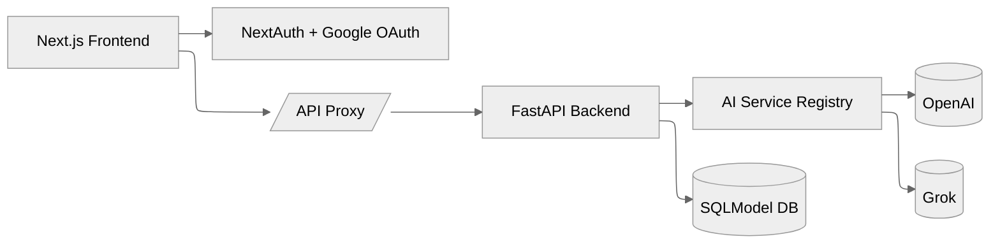

# Summary

PluginMind combines a hardened FastAPI backend with a production-ready Next.js frontend so your team can launch AI features without rebuilding the foundations. This overview gives you the why, what, and where of the platform in a single stop.

## Purpose & Scope

- **Ship faster** – Leverage pre-built auth, observability, queueing, and AI service orchestration instead of wiring them from scratch.
- **Stay secure** – Session cookies, correlation IDs, and defensive middleware are enabled out of the box.
- **Scale workflows** – The plugin-style AI service registry lets you route requests across OpenAI, Grok, and upcoming providers.

The stack is opinionated about high-assurance AI delivery: every request is logged, typed, and traceable from browser to model response.

## Architecture at a Glance



- **Frontend** – Next.js 14 App Router with protected routes, theming, and a proxy that attaches authenticated session cookies.
- **Backend** – FastAPI middleware layers enforce rate limiting, structured logging, and job tracing.
- **Registry** – Configurable plugins define prompt optimisers, analyzers, and health checks per model provider.

## Quick Start

```bash
# Spin up the backend
cd pluginmind_backend
pip install -r requirements.txt
uvicorn app.main:app --reload --host 0.0.0.0 --port 8000

# Launch the Next.js frontend
cd ../frontend
pnpm install
pnpm dev
```

Populate the environment variables listed in the root `README.md` before authenticating. Run `TESTING=1 pytest` inside `pluginmind_backend/` to validate integration points.

## Documentation Map

- **Guides** – Workflow recipes, deployment patterns, and security guardrails. Start with [Workflow Development](/docs/guides/workflow-development) or [AI Service Integration](/docs/guides/ai-service-integration).
- **Architecture** – Deep dives on [System Design](/docs/architecture/system-design) and the [Database Schema](/docs/architecture/database-schema).
- **API Reference** – Authentication flow and endpoints at [API Authentication](/docs/api/authentication) and [Endpoints](/docs/api/endpoints).
- **Operations** – Runbooks for [Monitoring](/docs/operations/monitoring), [Testing](/docs/operations/testing), and [Troubleshooting](/docs/operations/troubleshooting).

## Navigation Tips

1. Use the sidebar to expand a section; the active page stays highlighted while you navigate.
2. On mobile, tap the **Menu** button to open an accessible drawer with search-friendly grouping.
3. Copy code blocks with the clipboard button and switch diagrams on by using fenced ```mermaid blocks.

Ready to build something new? Dive into the [Guides](/docs/guides/workflow-development) section or jump straight to the [API Reference](/docs/api/endpoints) to wire the backend into your product.
